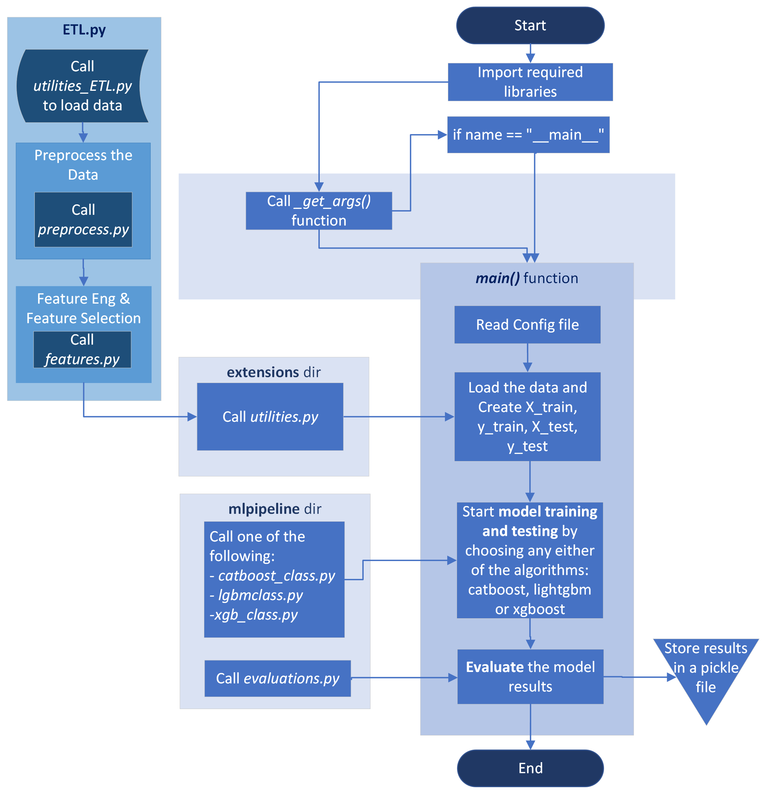

# Project Overview
This project explores hyperparameter tuning algorithms by evaluating their performance with Gradient-Boosting algorithms for the purposes of binary classification.

The project utilized object-oriented programming to created classes for each of the Gradient-Boosting algorithms - XGBoost, CatBoost and Light Gradient Boosting Machine (LGBM). These classes implemented the Gradient-Boosting algorithm from its respective library and allowed the application of Hyperopt, Optuna or Random Search as a method for tuning the respective hyperparameters. 

This project involved working in a team of 5 students under the supervision of Tanaby Zibamanzar Mofrad. It was conducted in an AGILE environment with the help of the **[Trello](https://trello.com/en)** platform. Version control was conducted through the Google Source Repository on the Google Cloud Platform (GCP.)

---

## Project Workflow

1. Created **[Pre-Processing Module](ETL_file/extensions/preprocess.py)** to clean the data and **[Feature Engineering Module](ETL_file/extensions/features.py)** to create new features using a Python framework Featuretools.
2. Created classes that implemented **[XGBoost](main_file/mlpipeline/xgb_class.py), [Catboost](main_file/mlpipeline/catboost_class.py)** and **[LightGBM](main_file/mlpipeline/lgbmclass.py)** boosting methods to train on the datasets with cross-validation.
3. Added **Hyperopt, Optuna** and **Random Search** to each class for algorithm-specific hyper-parameter tuning.
4. Performed **[Unit Testing](Tests)** using **Pytest** tool of Python.
5. Ran experiments on the **Google Cloud Platform (GCP)**
6. Evaluated performance of all combinations of the model and tuning method pairs against one another
7. Compared optimal performance with that of Google's AutoML.
8. Re-evaluated results using work done by previous research papers as benchmarks.

---

## Data Sources

The data used are available in public domain:

1. Higgs dataset has been produced using Monte Carlo simulations at Physics & Astronomy, Univ. of California Irvine. The dataset can be found at (http://archive.ics.uci.edu/ml/datasets/HIGGS).

It is a classification problem and identifies exotic particles in high-energy physics based on the sensors information. The postitive class (label 1) corresponds to signal sample for which events that produced Higgs bosons occured while the negative class (label 0) are for signal samples in which these events did no occur (i.e only background processes where in the signal sample).

The first 21 features (columns 2-22) are kinematic properties measured by the particle detectors in the accelerator. The last seven features are functions of the first 21 features which are high-level features derived by physicists to help discriminate between the two classes. For this project, we ignore the last 7 columns and use **[Featuretools](https://www.featuretools.com/)** python library to create new features and compare with previous studies. More details on the data and features can be found on the documentation from the HiggsML webpage: (https://higgsml.lal.in2p3.fr/files/2014/04/documentation_v1.8.pdf).

2. The Credit card Fraud Detection dataset is a widely used dataset for studying the imbalanced classification problem. It has a ratio of 500 negative:1 positive class instances. The dataset is taken from **[Kaggle](https://www.kaggle.com/mlg-ulb/creditcardfraud)** and has 30 features, 28 of which are PCA transformations to perserve confidentiality.

---

## Main Libraries

The following libraries were the central subject of the experiments in this project. Please refer to them for more detail on the machine learning algorithms or hyperparameter tuning methods.

XGBoost (https://xgboost.readthedocs.io/en/latest/)

CatBoost (https://catboost.ai/docs/)

LGBM (https://lightgbm.readthedocs.io/en/latest/)

HyperOpt (http://hyperopt.github.io/hyperopt/)

Optuna (https://optuna.readthedocs.io/en/stable/)

---

## Contributors:

As mentioned before, this is project was a team effort. The following members have contributed their time and effort:

Ahmed Al-Baz (https://github.com/albazahm)

Birkamel Kaur (https://github.com/Birkamal)

Kshitij Mamgain (https://github.com/kshitijmamgain)

Sasha Hajy Hassani (https://github.com/SHH116)

Taraneh Kordi (https://github.com/Taraneh-K)

Supervisor: Tanaby Zibamanzar Mofrad (https://github.com/tanabymofrad)
